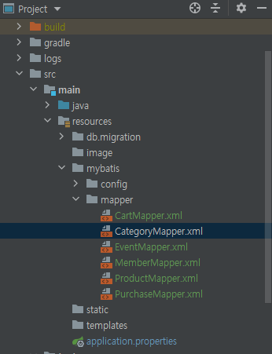

### SpringBoot - Mybatis 설정 및 연관관계 맵핑 (작성중)
SpringBoot-Mybatis 프로젝트 환경에서 제공해주는 기본옵션들과 
Mybatis에서 제공하는 연관관계 맵핑과 관련하여 정리하였다. 

##### 1. 프로젝트 의존성 설정 

~~~gradle
dependencies {
 implementation 'org.mybatis.spring.boot:mybatis-spring-boot-starter:2.1.4'
}
~~~
이렇게 의존성을 추가하면 스프링부트에서는 오토 스캐닝을 지원하여 `Mapper 인터페이스`(어노테이션)를 찾아
Bean으로 등록해준다. 
 
##### 2. Mapper 설정

Mapper 설정에는 총 2가지 파일 생성이 필요하다. 첫번째는 xml기반의 쿼리문, 객체 맵핑등을 기술한 xml파일과 이 xml파일의 기능들을
제공하기 위한 인터페이스 생성이다. 

2-1) 스프링 컨테이너에 등록할 Repository 생성
~~~java
@Mapper
public interface CategoryRepository {

    void save(Category category);
}
~~~
@Mapper 어노테이션이 붙어있으면 해당 인터페이스는 스프링 컨테이너에 bean으로 등록된다.

2-2) mapper.xml 생성 

~~~xml
<?xml version="1.0" encoding="UTF-8"?>
<!DOCTYPE mapper PUBLIC "-//mybatis.org//DTD Mapper 3.0//EN"
        "http://mybatis.org/dtd/mybatis-3-mapper.dtd">

<mapper namespace="com.example.practice.category.domain.CategoryRepository">

    <insert id="save" parameterType="category"
            useGeneratedKeys="true"  keyProperty="categoryId" >
      INSERT INTO categories
        (categoryCode, categoryName)
      VALUES
        (#{categoryCode}, #{categoryName})
    </insert>
</mapper>
~~~
이렇게 두 개의 파일을 프로젝트에 생성하였다면, 두 개의 파일을 이어줄 수 있는 `경로설정`이 필요하다. 왜냐하면
인터페이스를 통해 해당 xml의 쿼리문을 수행해야하는데 이 mapper 인터페이스가 xml 파일위치가 어디에 있는지 알 수 없기 
때문이다.   

2-3)properties 파일에 mapper 경로설정
~~~properties
mybatis.mapper-locations=mybatis/mapper/*.xml
~~~
이렇게 경로에 대한 설정을 해주면, mapper 인터페이스가 해당 xml을 찾아서 요청하여 mybatis를 사용하게 된다.
기본적으로 mapper-locations는 루트구조가 resources폴더로 되어있기에 resources폴더 하위에 mapper 폴더 경로를 적어주면된다.

이렇게 mapper xml 경로를 설정을 완료하였다면 mapper 인터페이스에서 xml를 사용할 수 있게 된다. 여기서 mapper 인터페이스에
기술된 메서드명과 xml에 쿼리문에 기술된 id값이 일치해야 해당 쿼리문을 수행 할 수 있다.

##### 3. 연관관계 맵핑

3.1) has one 관계 
has one 관계인 객체로 맵핑할 경우 `<association>` 태그로 맵핑할 수 있으며, 두 가지 맵핑 전략이 존재한다.  

- Nested Select : 다른 맵핑된 SQL 구문을 실행하여 맵핑하는 방법
- Nested Result : 하나의 JOIN 쿼리로 결과를 맵핑하는 방법

3.1.1) Nested Result 

~~~xml
    <resultMap id="Product" type="com.example.practice.product.domain.Product">
        <id property="productId"       column="productId"/>
        <result property="productName" column="productName"/>
        <result property="image" column="image"/>
        <result property="description" column="description"/>
        <result property="registeredDate" column="registeredDate"/>
        <association property="seller"         javaType="com.example.practice.member.domain.Member">
            <id property="memberSequence"       column="memberSequence"/>
            <result property="memberId"         column="memberId"/>
            <result property="phoneNumber"      column="phoneNumber"/>
            <result property="description"      column="address"/>
        </association>
    </resultMap>    
~~~
~~~java
@Builder
@NoArgsConstructor(access = AccessLevel.PROTECTED)
@AllArgsConstructor(access = AccessLevel.PRIVATE)
@EqualsAndHashCode(exclude = {"seller", "productName", "image", "description", "registeredDate", "price", "category"})
public class Product {
	
	private Long productId;
	private String productName;
	private Member seller;
	private String image;
	private Money price;
	private String description;
	private LocalDateTime registeredDate;
	private Category category;
    
    //생략.. 
}
~~~
 
 
 맵핑하는 전략은 2가지 방식이 있다. 

3-2) has many 관계

3-3) 생성자 검증 

[Refference]
- https://mybatis.org/spring-boot-starter/mybatis-spring-boot-autoconfigure
- https://blog.mybatis.org/2019/01/mybatis-350-released.html